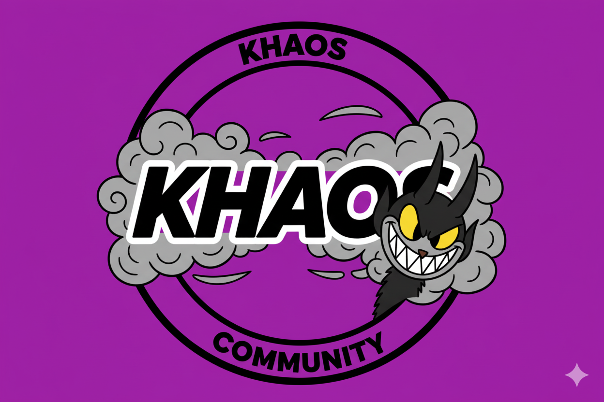

# 🚀 CarregadoStore - Sistema Completo de Pagamento PIX

## ⚙️ CONFIGURAÇÃO COMPLETA - GUIA PASSO A PASSO

> **📌 IMPORTANTE:** Configure TODOS os itens abaixo antes de publicar seu site!

---

## 🎨 1. PERSONALIZAÇÃO VISUAL (index.html)

### 📝 Nome e Identidade

- [ ] **Título da Página** - `index.html` **linha 6**
  ```html
  <title>KhaosStore - Perfil</title>
  ```
  👉 Troque `KhaosStore` pelo nome da sua loja/perfil

- [ ] **Nome do Perfil (Header)** - `index.html` **linha 65**
  ```html
  <h1 class="profile-name">
      KhaosStore<i class="fas fa-check-circle verified"></i>
  </h1>
  ```
  👉 Troque `KhaosStore` pelo seu nome

- [ ] **Nome do Perfil (Info)** - `index.html` **linha 106**
  ```html
  <h2 class="profile-username">
      KhaosStore<i class="fas fa-check-circle verified"></i>
  </h2>
  ```
  👉 Troque `KhaosStore` pelo seu nome

- [ ] **Handle/Username** - `index.html` **linha 108**
  ```html
  <p class="profile-handle">use.khaos <span class="separator">•</span> Visto Ontem</p>
  ```
  👉 Troque `use.khaos` pelo seu username

- [ ] **Descrição/Bio** - `index.html` **linha 111**
  ```html
  <p>faço ferramentas ou clono paginas pra players do hot ><</p>
  ```
  👉 Escreva sua descrição personalizada

- [ ] **Mensagem Promocional** - `index.html` **linha 133**
  ```html
  <p>faça demandas personalizadas comigo 😘😊</p>
  ```
  👉 Personalize sua mensagem promocional

- [ ] **Mensagem Promocional (Sidebar)** - `index.html` **linha 302**
  ```html
  <p>faça demandas personalizadas comigo 😘😊</p>
  ```
  👉 Mesma mensagem da linha 133

### 📊 Estatísticas do Perfil

- [ ] **Estatísticas (Header)** - `index.html` **linhas 69-82**
  ```html
  <span class="stat-item">
      <i class="far fa-image"></i> 388
  </span>
  <span class="stat-item">
      <i class="far fa-play-circle"></i> 67
  </span>
  <span class="stat-item">
      <i class="fas fa-broadcast-tower"></i> 33
  </span>
  <span class="stat-item">
      <i class="far fa-heart"></i> 193.1K
  </span>
  ```
  👉 Ajuste os números conforme suas estatísticas reais

- [ ] **Estatísticas (Conteúdo Bloqueado)** - `index.html` **linhas 192-198**
  ```html
  <span><i class="far fa-image"></i> 386</span>
  <span><i class="far fa-play-circle"></i> 388</span>
  <span><i class="far fa-video"></i> 67</span>
  <span><i class="fas fa-microphone"></i> 2</span>
  ```
  👉 Ajuste os números conforme suas estatísticas reais

- [ ] **Contador de Postagens** - `index.html` **linha 166**
  ```html
  <button class="tab active">386 POSTAGENS</button>
  ```
  👉 Ajuste o número de postagens

- [ ] **Contador de Mídia** - `index.html` **linha 169**
  ```html
  <button class="tab">457 MÍDIA</button>
  ```
  👉 Ajuste o número de mídia

### 🖼️ Imagens e Vídeos

- [ ] **Banner do Perfil** - `index.html` **linha 95**
  ```html
  
  ```
  👉 Substitua `Images/banner.jpg` pela sua imagem (1920x400px recomendado)

- [ ] **Foto de Perfil** - `index.html` **linha 101**
  ```html
  
  ```
  👉 Substitua `Images/profile.jpg` pela sua foto (400x400px recomendado)

- [ ] **Foto de Perfil (Promo)** - `index.html` **linha 132**
  ```html
  
  ```
  👉 Mesma foto da linha 101

- [ ] **Foto de Perfil (Sidebar)** - `index.html` **linha 301**
  ```html
  
  ```
  👉 Mesma foto da linha 101

- [ ] **Vídeo Central (Preview)** - `index.html` **linha 180**
  ```html
  <source src="Images/central.mp4" type="video/mp4">
  ```
  👉 Substitua `Images/central.mp4` pelo seu vídeo de preview

- [ ] **Mídias Laterais** - `index.html` **linhas 213, 221, 229, 238, 248, 258, 267, 275, 283**
  ```html
  
  
  
  <source src="Images/lateral-4.m4v" type="video/mp4">
  <source src="Images/lateral-5.m4v" type="video/mp4">
  <source src="Images/lateral-6.mp4" type="video/mp4">
  
  
  
  ```
  👉 Substitua pelas suas imagens/vídeos (suporta .jpg, .mp4, .m4v)

---

## 💳 2. CONFIGURAÇÃO DE PAGAMENTO

### 🔴 Token PushinPay (OBRIGATÓRIO)

- [ ] **Token PushinPay** - `pushinpay-real.js` **linha 6**
  ```javascript
  token: 'SEU_TOKEN_PUSHINPAY_AQUI'
  ```
  👉 Cole seu token do PushinPay
  📍 Como obter: https://pushinpay.com.br → Configurações → API

### 💰 Preços e Planos

- [ ] **Configurar Planos** - `script.js` **linha 400**
  ```javascript
  const PLANOS = {
      'Mensal': { preco: 19.90, duracao: '1 mês', dias: 31 },
      'Trimestral': { preco: 49.90, duracao: '3 meses', dias: 90 },
      'Anual': { preco: 149.90, duracao: '12 meses', dias: 365 }
  };
  ```
  👉 Ajuste os preços conforme seus planos

- [ ] **Preço Mensal (Botão Principal)** - `index.html` **linha 139**
  ```html
  <span class="price">$3.75 por 31 dias</span>
  ```
  👉 Ajuste o preço e período exibido

- [ ] **Preço Normal** - `index.html` **linha 142**
  ```html
  <p class="normal-price">Preço Normal $15 /mês</p>
  ```
  👉 Ajuste o preço normal exibido

- [ ] **Preço Trimestral** - `index.html` **linha 153**
  ```html
  <span class="package-price">$9.99 total</span>
  ```
  👉 Ajuste o preço do plano trimestral

- [ ] **Preço Anual** - `index.html` **linha 157**
  ```html
  <span class="package-price">$29.99 total</span>
  ```
  👉 Ajuste o preço do plano anual

- [ ] **Preço Sidebar** - `index.html` **linha 308**
  ```html
  <span class="price">$3.75 por 31 dias</span>
  ```
  👉 Mesmo preço da linha 139

- [ ] **Preço Normal Sidebar** - `index.html` **linha 311**
  ```html
  <p class="normal-price-small">Preço Normal $15 /mês</p>
  ```
  👉 Mesmo preço da linha 142

---

## 📱 3. CONFIGURAÇÃO DE NOTIFICAÇÕES

### 🔴 WhatsApp (OBRIGATÓRIO)

- [ ] **Link do Drive** - `agradecimento.html` **linha 154**
  ```javascript
  const DRIVE_DEEPLINK = 'https://drive.google.com/drive/folders/SEU_ID_DO_DRIVE?usp=sharing';
  ```
  👉 Substitua `SEU_ID_DO_DRIVE` pelo ID real do seu Google Drive
  📍 Como obter: Compartilhe a pasta no Drive → Copie o ID da URL

> **⚠️ NOTA:** O sistema foi atualizado e não solicita mais dados do cliente. O link do Drive é acessado diretamente após o pagamento.

### 🔴 Telegram (OBRIGATÓRIO)

- [ ] **Bot Token e Chat ID** - `agradecimento.html` **linhas 444-445** (se ainda existir)
  ```javascript
  const BOT_TOKEN = '8127806329:AAFl-lNVkJ8YKC_DoG8VgoEUMjDUZT5eZ8A';
  const CHAT_ID = '8100970469';
  ```
  👉 Configure seu bot do Telegram
  📍 Como criar: Telegram → @BotFather → /newbot
  📍 Obter Chat ID: Telegram → @userinfobot → /start

> **⚠️ NOTA:** Como o formulário foi removido, as notificações automáticas não são mais enviadas. O cliente acessa o Drive diretamente.

---

## 📊 4. CONFIGURAÇÃO DE RASTREAMENTO

### 🟡 Facebook Pixel (OPCIONAL)

- [ ] **Facebook Pixel ID** - `agradecimento.html` **linha 138**
  ```javascript
  fbq('init', 'SEU_PIXEL_ID_AQUI');
  ```
  👉 Substitua `SEU_PIXEL_ID_AQUI` pelo seu Pixel ID do Facebook

- [ ] **Facebook Pixel (noscript)** - `agradecimento.html` **linha 143**
  ```html
  
  ```
  👉 Substitua `SEU_PIXEL_ID_AQUI` pelo mesmo Pixel ID

---

## 🎨 5. PERSONALIZAÇÃO DE CORES (OPCIONAL)

- [ ] **Cores do Tema** - `styles.css` **linhas 7-15**
  ```css
  AZUL PRIMÁRIO:  #00b8ff
  AZUL MÉDIO:     #0095d4
  AZUL CLARO:     #00d9ff
  FUNDO ESCURO:   #1a1a1a
  FUNDO PRETO:    #0f0f0f
  ```
  👉 Ajuste as cores conforme sua identidade visual

---

## ✅ CHECKLIST RÁPIDO

### 🔴 OBRIGATÓRIO (Não funciona sem isso!)
- [ ] Token PushinPay (`pushinpay-real.js` linha 6)
- [ ] Link do Drive (`agradecimento.html` linha 154)
- [ ] Nome do perfil (`index.html` linhas 6, 65, 106)
- [ ] Fotos (banner.jpg, profile.jpg na pasta `Images/`)

### 🟡 RECOMENDADO (Melhora a experiência)
- [ ] Descrição/Bio (`index.html` linha 111)
- [ ] Preços dos planos (`script.js` linha 400)
- [ ] Estatísticas (`index.html` linhas 69-82, 192-198)
- [ ] Facebook Pixel (`agradecimento.html` linha 138)
- [ ] Vídeos e mídias (pasta `Images/`)

---

---

## 📂 ESTRUTURA DO PROJETO

```
📁 OnlyFans Tela arrumar/          ← PASTA PRINCIPAL (CORE)
│
├── 📄 index.html                   ⭐ Página principal
├── 📄 agradecimento.html           ⭐ Página pós-pagamento
├── 📄 remarketing.html             📊 Dashboard de remarketing
├── 📄 links-rastreamento.html      🔗 Gerador de links UTM
│
├── 🎨 styles.css                   ⭐ Estilos (tema azul)
├── ⚙️ script.js                    ⭐ Sistema de pagamento
├── 💳 pushinpay-real.js            ⭐ API PushinPay
│
├── 📁 Images/                      🖼️ Fotos e vídeos
│   ├── banner.jpg
│   ├── profile.jpg
│   ├── central.mp4
│   └── lateral-*.jpg/mp4/m4v
│
├── 📁 js/                          🔧 Scripts auxiliares
│   ├── database.js
│   ├── lead-tracking.js
│   └── facebook-pixel.js
│
├── 📁 models/                      🗄️ Backend (opcional)
│   ├── User.js
│   └── Subscription.js
│
├── 📁 routes/                      🛣️ Backend (opcional)
│   ├── payments.js
│   ├── webhooks.js
│   └── subscriptions.js
│
├── 🔧 server.js                    🖥️ Servidor Node.js (opcional)
├── 🗄️ database.js                  💾 Config SQLite (opcional)
├── 📦 package.json                 📋 Dependências Node.js
│
└── 📖 ME_LEIA.md                   📚 ESTE ARQUIVO
```

### ⭐ Arquivos ESSENCIAIS (Frontend apenas)
```
✅ index.html
✅ agradecimento.html
✅ styles.css
✅ script.js
✅ pushinpay-real.js
✅ Images/ (pasta completa)
✅ js/database.js
✅ js/lead-tracking.js
```

### 🔧 Arquivos OPCIONAIS (Backend)
```
⚙️ server.js
⚙️ database.js
⚙️ models/
⚙️ routes/
⚙️ package.json
⚙️ node_modules/
```

---

## 🎯 COMO USAR (INÍCIO RÁPIDO)

### 1️⃣ Configurar (10 minutos)
```
1. Abra index.html → Personalize nome, fotos, descrição
2. Abra pushinpay-real.js → Cole seu token (linha 6)
3. Abra agradecimento.html → Configure link do Drive (linha 154)
4. Abra script.js → Ajuste preços (linha 400)
5. Coloque suas imagens na pasta Images/
```

### 2️⃣ Testar Localmente
```
1. Abra index.html no navegador
2. Clique em "ASSINAR"
3. Veja o modal PIX aparecer
```

### 3️⃣ Publicar Online
```
Opções Gratuitas:
• Vercel: https://vercel.com
• Netlify: https://netlify.com
• GitHub Pages: https://pages.github.com

Envie apenas os arquivos ESSENCIAIS ⭐
```

---

## 💰 SISTEMA DE PAGAMENTO PIX

### Como Funciona:

```
USUÁRIO CLICA "ASSINAR"
         ↓
MODAL ABRE COM QR CODE PIX
         ↓
SISTEMA GERA PIX (PushinPay)
         ↓
USUÁRIO PAGA VIA APP BANCO
         ↓
VERIFICAÇÃO AUTOMÁTICA (5s)
         ↓
PAGAMENTO DETECTADO ✅
         ↓
REDIRECIONA → agradecimento.html
         ↓
BOTÃO DIRETO PARA O DRIVE
         ↓
CLIENTE ACESSA CONTEÚDO IMEDIATAMENTE
```

### Recursos:
✅ **QR Code Dinâmico** - Gerado automaticamente
✅ **Código PIX Copiável** - Um clique para copiar
✅ **Timer de 15 Minutos** - Expira automaticamente
✅ **Verificação Automática** - Detecta pagamento em 5s
✅ **Scroll Responsivo** - Funciona em mobile
✅ **Scrollbar Customizada** - Tema azul OnlyFans

---

## 🎨 PLANOS E PREÇOS

| Plano | Preço | Desconto | Botão |
|-------|-------|----------|-------|
| **Mensal** | R$ 19,90 | - | ASSINAR |
| **Trimestral** | R$ 49,90 | 33% off | 3 MESES |
| **Anual** | R$ 149,90 | 50% off | 12 MESES |

**Para alterar:** `script.js` linha 400

---

## 📱 DASHBOARD DE REMARKETING

### 🌐 Como Acessar:
```
Opção 1: Clique duas vezes em remarketing.html
Opção 2: https://seusite.com/remarketing.html (online)
Opção 3: http://localhost:5500/remarketing.html (local)
```

### 📊 Funcionalidades:
- ✅ Estatísticas em tempo real
- ✅ Filtros por status, tags, origem
- ✅ Criação de campanhas WhatsApp/Email
- ✅ Exportação CSV/JSON
- ✅ Backup automático (5 min)
- ✅ Segmentação de clientes
- ✅ Download de contatos (.txt)

### 🎯 Filtros Disponíveis:
- **Status**: Pagos / Pendentes / Expirados
- **Tags**: Convertido / VIP / Interessado / Pago
- **Origem**: Site / Instagram / Facebook / TikTok
- **Busca**: Nome, email, telefone

### 📧 Criar Campanha:
1. Selecione clientes (checkbox)
2. Clique "➕ Nova Campanha"
3. Preencha nome, tipo e mensagem
4. Clique "Criar Campanha"
5. Execute quando quiser

---

## 🔗 GERADOR DE LINKS UTM

### 📍 Acesso:
```
Clique duas vezes em: links-rastreamento.html
```

### 🎯 Para Que Serve:
Gerar links rastreáveis para saber de onde vêm seus clientes!

### 📋 Exemplo:
```
Link Base: https://seusite.com
Origem: instagram
Meio: post
Campanha: promo-black-friday

Link Gerado:
https://seusite.com?utm_source=instagram&utm_medium=post&utm_campaign=promo-black-friday

✅ Você saberá que esse cliente veio do Instagram!
```

### 🏷️ Origens Rastreadas:
- Instagram Stories/Feed
- Facebook Ads
- TikTok Bio
- YouTube Descrição
- Email Marketing
- WhatsApp Status

---

## 🎨 CORES DO TEMA

```css
AZUL PRIMÁRIO:  #00b8ff  ████
AZUL MÉDIO:     #0095d4  ████
AZUL CLARO:     #00d9ff  ████

FUNDO ESCURO:   #1a1a1a  ████
FUNDO PRETO:    #0f0f0f  ████
TEXTO BRANCO:   #ffffff  ████
CINZA:          #8e8e93  ████
```

**Para alterar:** `styles.css` linha 7-15

---

## 🔧 CONFIGURAÇÕES AVANÇADAS

### ⏱️ Timer de Expiração do PIX
**Arquivo:** `script.js` linha 438
```javascript
iniciarTimer(900); // 900s = 15 minutos
```
Outros valores:
- 600 = 10 minutos
- 1200 = 20 minutos
- 1800 = 30 minutos

### 🔄 Intervalo de Verificação
**Arquivo:** `pushinpay-real.js` linha 134
```javascript
}, 5000); // Verificar a cada 5 segundos
```
Outros valores:
- 3000 = 3 segundos (mais rápido)
- 10000 = 10 segundos (economiza API)

---

## 🧪 TESTE ANTES DE PUBLICAR

### ✅ Checklist de Testes:

**Desktop:**
- [ ] Modal PIX abre corretamente
- [ ] QR Code aparece
- [ ] Timer funciona
- [ ] Botão "Copiar" funciona
- [ ] Scroll do modal funciona
- [ ] Redireciona após pagamento
- [ ] Notificações chegam

**Mobile:**
- [ ] Layout responsivo OK
- [ ] Modal abre bem
- [ ] QR Code legível
- [ ] Formulário usável
- [ ] Scroll suave

**Pagamento:**
- [ ] Fazer pagamento teste
- [ ] Verificação automática funciona
- [ ] Dados salvos no sistema
- [ ] WhatsApp recebe notificação
- [ ] Telegram recebe notificação

---

## 🐛 SOLUÇÃO DE PROBLEMAS

### ❌ QR Code não aparece
**Causa:** Token PushinPay inválido
**Solução:**
1. Abra `pushinpay-real.js`
2. Verifique se o token está correto
3. Teste no console (F12): `console.log(PushinPayReal.config.token)`

### ❌ Pagamento não é detectado
**Causa:** Verificação desativada ou API offline
**Solução:**
1. Aguarde até 5 segundos
2. Abra Console (F12) e veja erros
3. Verifique se PushinPay está online

### ❌ Notificações não chegam
**Causa:** Credenciais incorretas
**Solução:**
1. WhatsApp: Confirme formato (55 + DDD + número)
2. Telegram: Teste bot manualmente enviando /start
3. Verifique se BOT_TOKEN está correto

### ❌ Modal não abre
**Causa:** Script não carregou
**Solução:**
1. Verifique se `pushinpay-real.js` está ANTES de `script.js` no HTML
2. Abra Console (F12) e veja erros
3. Recarregue a página (Ctrl+F5)

### ❌ Scroll não funciona no modal
**Causa:** Navegador antigo
**Solução:**
1. Atualize o navegador
2. Teste em Chrome/Firefox/Edge atualizados

---

## 📞 SUPORTE E RECURSOS

### 🔗 APIs Utilizadas:
- **PushinPay:** https://pushinpay.com.br
- **Telegram Bots:** https://core.telegram.org/bots
- **WhatsApp Business:** https://business.whatsapp.com

### 📚 Tecnologias:
- **Frontend:** HTML5, CSS3, JavaScript ES6+
- **Frameworks:** Tailwind CSS (agradecimento/dashboard)
- **Ícones:** Font Awesome 6.4.0
- **Backend (opcional):** Node.js, Express, SQLite

### 🎓 Aprenda Mais:
- **PIX:** Como funciona o PIX no Brasil
- **UTM Parameters:** Google Analytics UTM Builder
- **Remarketing:** Estratégias de conversão

---

## 🚀 PRÓXIMOS PASSOS RECOMENDADOS

### 📈 Otimizações:
1. **Google Analytics**
   - Rastrear eventos de pagamento
   - Acompanhar conversão por plano
   - Analisar funil de vendas

2. **Facebook Pixel**
   - Já configurado em `agradecimento.html`
   - Substitua `SEU_PIXEL_ID_AQUI`
   - Rastreie conversões para campanhas

3. **Email Marketing**
   - Integrar com Mailchimp/SendGrid
   - Enviar email de boas-vindas
   - Campanha de recuperação

4. **Sistema de Cupons**
   - Adicionar códigos promocionais
   - Desconto por tempo limitado
   - Cupons de afiliados

5. **Dashboard Admin**
   - Painel de vendas em tempo real
   - Gráficos de conversão
   - Relatórios mensais

---

## 📊 DADOS E PRIVACIDADE

### 💾 Onde os Dados Ficam:
- **localStorage** do navegador (frontend)
- **database.sqlite** (se usar backend)
- **PushinPay** (transações)

### 🔒 Segurança:
- Tokens nunca expostos publicamente
- HTTPS recomendado em produção
- Dados criptografados pela PushinPay
- Backup automático a cada 5 minutos

### 📋 LGPD:
- Sistema coleta apenas dados necessários
- Usuário consente ao preencher formulário
- Dados usados apenas para entrega do produto
- Possível adicionar política de privacidade

---

## 🎉 CHANGELOG

### v1.1 - Atualização Recente
- ✅ Removido formulário de coleta de dados
- ✅ Acesso direto ao Drive após pagamento
- ✅ Interface simplificada e mais rápida
- ✅ Experiência do usuário otimizada

### v1.0 - 13/10/2025
- ✅ Removida integração PayPal
- ✅ Implementado sistema PIX (PushinPay)
- ✅ Cores atualizadas (tema azul OnlyFans)
- ✅ Modal de pagamento com scroll
- ✅ Scrollbar customizada
- ✅ Timer de expiração
- ✅ Verificação automática
- ✅ Dashboard de remarketing
- ✅ Gerador de links UTM
- ✅ Sistema de tags e segmentação
- ✅ Exportação CSV/JSON
- ✅ Backup automático

---

## 💡 DICAS PROFISSIONAIS

### 🎯 Marketing:
1. Use links UTM em todas as campanhas
2. Teste diferentes mensagens de remarketing
3. Segmente por origem para ofertas personalizadas
4. Analise qual plano converte mais

### 💰 Vendas:
1. Ofereça desconto progressivo (quanto mais tempo, maior desconto)
2. Crie urgência com timer no modal
3. Recupere carrinhos abandonados
4. Follow-up automático com pendentes

### 📊 Analytics:
1. Monitore taxa de conversão semanal
2. Identifique origens com melhor ROI
3. Teste A/B com diferentes preços
4. Acompanhe valor médio do ticket

---

## ✅ STATUS DO SISTEMA

```
✅ Sistema de pagamento PIX - FUNCIONANDO
✅ Modal responsivo com scroll - FUNCIONANDO
✅ Verificação automática - FUNCIONANDO
✅ Acesso direto ao Drive - FUNCIONANDO
✅ Dashboard remarketing - FUNCIONANDO
✅ Gerador links UTM - FUNCIONANDO
✅ Exportação de dados - FUNCIONANDO
✅ Tema azul OnlyFans - APLICADO
✅ Mobile responsive - FUNCIONANDO

⚙️ REQUER CONFIGURAÇÃO:
   - Token PushinPay (OBRIGATÓRIO)
   - Link do Drive (OBRIGATÓRIO)
   - Nome e fotos do perfil (OBRIGATÓRIO)
   - Preços dos planos (RECOMENDADO)
   - Pixel Facebook (OPCIONAL)
```

---

## 📝 QUICK START (2 MINUTOS)

```bash
1. Personalize index.html
   → Troque nome (linhas 6, 65, 106)
   → Troque descrição (linha 111)
   → Coloque suas fotos na pasta Images/

2. Configure pagamento
   → pushinpay-real.js → Token (linha 6)
   → agradecimento.html → Link Drive (linha 154)
   → script.js → Preços (linha 400)

3. Teste localmente
   → Abra index.html no navegador
   → Clique "ASSINAR"
   → PRONTO! 🚀
```

---

## 🎓 ARQUIVOS DE REFERÊNCIA

Se precisar de ajuda adicional, consulte:

### Frontend:
- `index.html` - Estrutura da página principal
- `styles.css` - Todos os estilos (linha 7: cores)
- `script.js` - Lógica de pagamento (linha 400: planos)

### Pagamento:
- `pushinpay-real.js` - API PushinPay (linha 6: token)
- `agradecimento.html` - Pós-pagamento (linha 154: link do Drive)

### Remarketing:
- `remarketing.html` - Dashboard completo
- `js/database.js` - Sistema de dados
- `js/lead-tracking.js` - Rastreamento

---

**Desenvolvido para CarregadoStore** 🚀

**Última Atualização:** 13/10/2025  
**Versão:** 1.0.0  
**Status:** ✅ PRONTO PARA PRODUÇÃO

---

> 💡 **Dica Final:** Salve este arquivo nos favoritos! Todas as informações importantes estão aqui.
